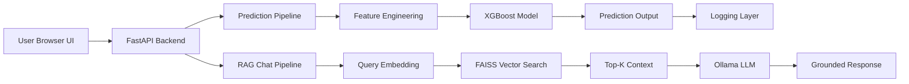

# AI Sales Prediction Platform

A full-stack AI system that combines **machine learning-based sales forecasting** with an **LLM-powered RAG assistant**, enabling both real-time predictions and intelligent, context-aware user guidance.

---

## System Architecture

---

## Phase 1: Machine Learning Prediction Pipeline

Built an end-to-end **sales forecasting system** using the Rossmann dataset by integrating transactional data with store-level metadata and preparing it for time-aware supervised learning.

### Key Steps

- **Data Preprocessing**
  - Filtered closed stores
  - Handled missing competition and promotion data
  - Extracted temporal features: `Year`, `Month`, `Day`, `DayOfWeek`, `IsWeekend`, `IsStateHoliday`

- **Feature Engineering**
  - One-hot encoding for categorical variables (`StoreType`, `Assortment`, `PromoInterval`)
  - Created lag features: `Sales_lag1`
  - Rolling statistics: `Sales_roll7_mean`
  - Store segmentation using **KMeans clustering**

- **Modeling & Evaluation**
  - Time-based train/test split (pre-2015 vs post-2015)
  - Benchmarked multiple models:
    - Linear Regression, Ridge, Lasso
    - Decision Tree, Random Forest
    - **XGBoost (best performance)**

- **Production Considerations**
  - Saved trained model + feature schema
  - Ensured training-serving consistency
  - Exposed prediction API via FastAPI

### Technologies Used
`FastAPI`, `XGBoost`, `Pandas`, `NumPy`, `scikit-learn`, `KMeans`, `Bootstrap`

---

## Phase 2: AI RAG-Based Assistant

Extended the platform with an **LLM-powered assistant** using a Retrieval-Augmented Generation (RAG) architecture to provide explainability and user guidance.

### Workflow

1. **Document Processing**
   - Project documentation split into chunks
   - Converted into embeddings using SentenceTransformers

2. **Vector Storage**
   - Stored embeddings in **FAISS** for fast similarity search

3. **Query Handling**
   - User query → embedding
   - Retrieve top-K relevant chunks

4. **LLM Generation**
   - Context passed to **Ollama (Llama 3.1)**
   - Generates grounded, context-aware responses

5. **Guardrails**
   - Restricts responses to project-specific knowledge
   - Prevents hallucinations outside domain

### Technologies Used
`SentenceTransformers`, `FAISS`, `Ollama (Llama 3.1)`, `FastAPI`, `Prompt Engineering`

---

## Key Features

- Real-time sales prediction via REST API  
- Context-aware AI assistant (RAG)  
- Vector similarity search using FAISS  
- FastAPI-based scalable backend  
- Modular ML + LLM pipeline architecture  
- Guardrails for controlled LLM responses  

---

## Key Learnings

- Serving ML models in production using APIs  
- Designing robust feature engineering pipelines  
- Building end-to-end RAG systems  
- Implementing vector search with FAISS  
- Running local LLMs using Ollama  
- Prompt engineering and response grounding  
- Full-stack AI system design  

